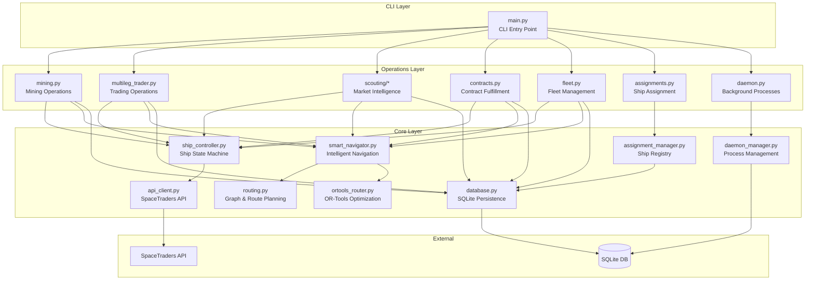
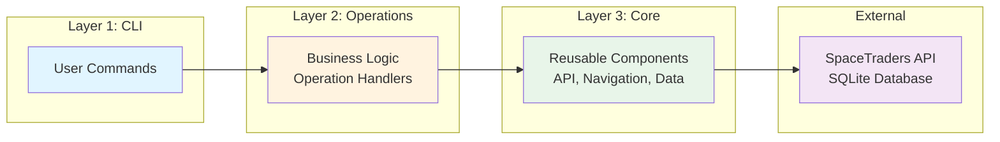
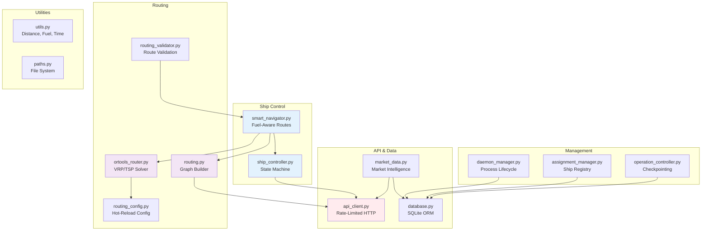
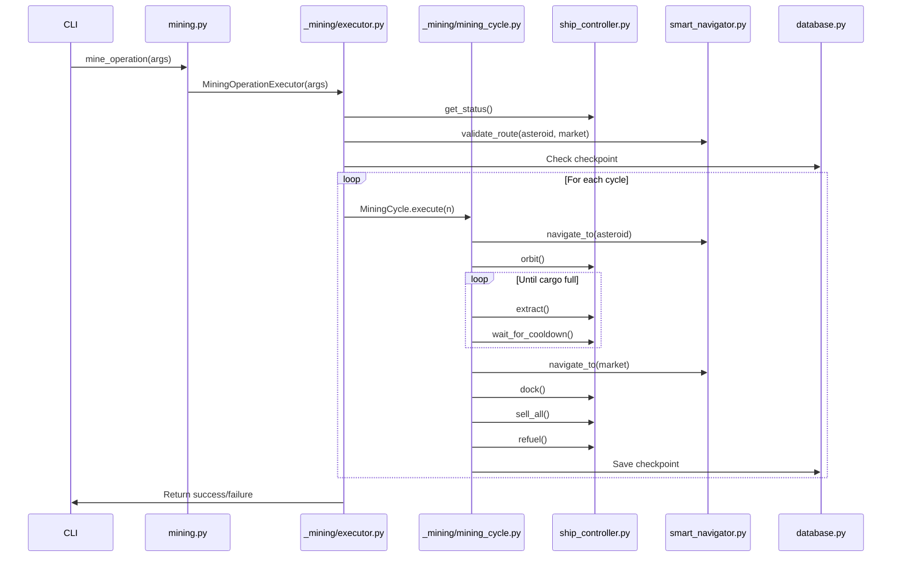
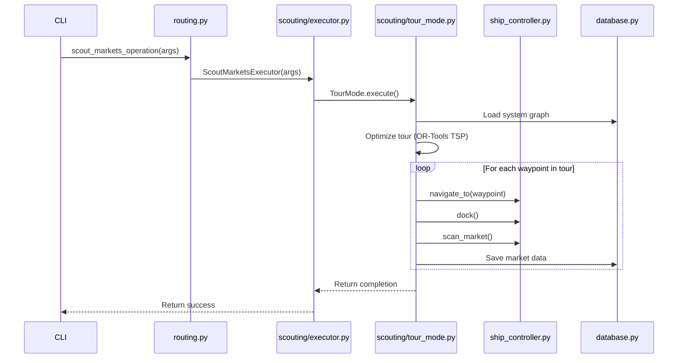
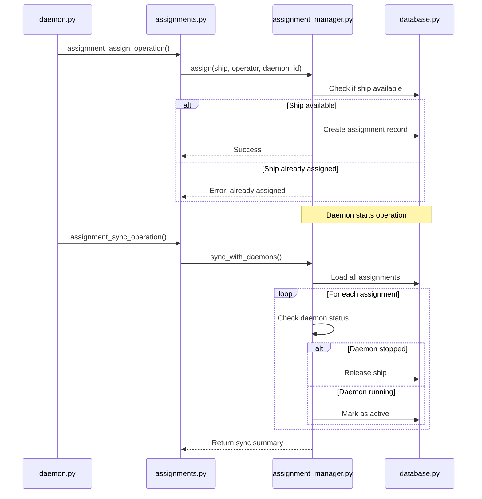
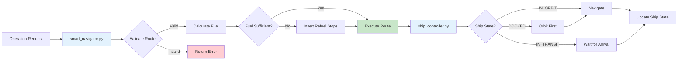
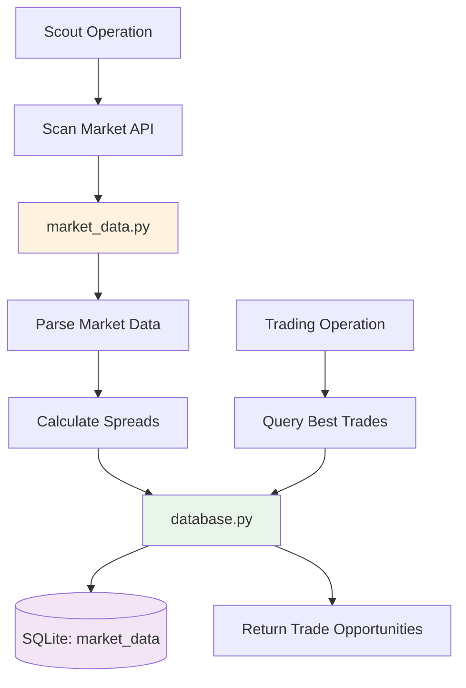
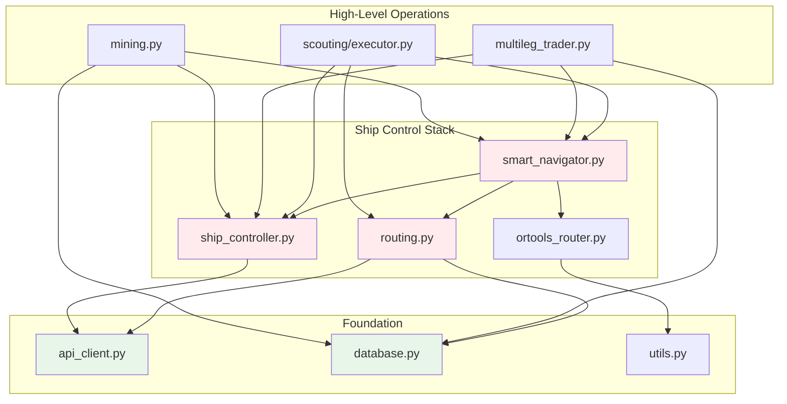
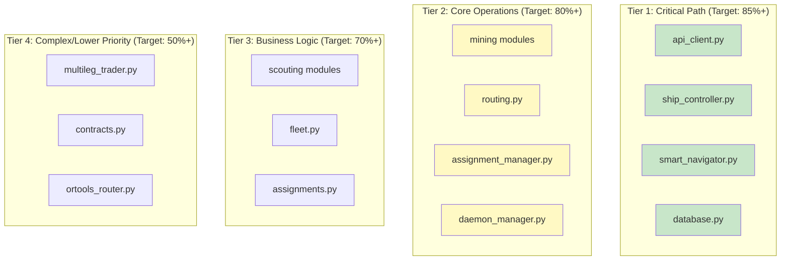

# SpaceTraders Bot - Architecture Documentation

**Generated:** 2025-10-20
**Purpose:** Document module relationships, dependencies, and architectural patterns for test coverage strategy

---

## Table of Contents

1. [High-Level Architecture](#high-level-architecture)
2. [Layer Diagram](#layer-diagram)
3. [Core Components](#core-components)
4. [Operations Layer](#operations-layer)
5. [Data Flow](#data-flow)
6. [Module Dependency Graph](#module-dependency-graph)
7. [Test Coverage Strategy](#test-coverage-strategy)

---

## High-Level Architecture

The SpaceTraders bot follows a **3-layer architecture** with clear separation of concerns:

---

## Layer Diagram

**Design Principles:**
- **CLI Layer**: Thin argument parsing, delegates to operations
- **Operations Layer**: Domain-specific workflows (mining, trading, scouting)
- **Core Layer**: Reusable primitives (API client, navigation, ship control)
- **External**: Third-party services and persistence

---

## Core Components

### Core Module Relationships

### Key Responsibilities

| Component | Purpose | Dependencies |
|-----------|---------|--------------|
| **api_client.py** | Rate-limited SpaceTraders API client | None (external API) |
| **ship_controller.py** | Ship state machine (DOCKED/ORBIT/TRANSIT) | api_client |
| **smart_navigator.py** | Fuel-aware pathfinding with auto-refuel | routing, ortools_router, ship_controller |
| **routing.py** | Graph building, route planning, tour optimization | api_client, database |
| **ortools_router.py** | Google OR-Tools VRP/TSP solver | routing_config |
| **database.py** | SQLite persistence layer | None (SQLite) |
| **daemon_manager.py** | Background process management | database |
| **assignment_manager.py** | Ship allocation registry | database, daemon_manager |

---

## Operations Layer

### Mining Operation Flow

### Scouting Operation Flow

### Assignment Management Flow

---

## Data Flow

### Ship Navigation with Fuel Management

### Market Data Collection

---

## Module Dependency Graph

### Critical Path Dependencies

### Shared Dependencies

**Most Depended-On Modules** (ordered by importance):

1. **api_client.py** - Used by: ship_controller, routing, market_data, all operations
2. **database.py** - Used by: routing, market_data, daemon_manager, assignment_manager, operation_controller
3. **ship_controller.py** - Used by: All operations (mining, trading, scouting, contracts)
4. **smart_navigator.py** - Used by: All navigation-heavy operations
5. **utils.py** - Used by: Most modules for distance, fuel, time calculations

---

## Test Coverage Strategy

### Coverage Tiers

### Current Coverage Status

| Module | Current | Target | Status | Priority |
|--------|---------|--------|--------|----------|
| **routing.py** | 85.8% | 85% | ✅ DONE | Critical |
| **mining_cycle.py** | 92.2% | 85% | ✅ DONE | Critical |
| **assignments.py** | 79.0% | 85% | ⚠️ Close | High |
| **tour_mode.py** | 64.8% | 85% | 🔨 Next | High |
| **scouting/executor.py** | 63.4% | 85% | 🔨 Next | High |
| **smart_navigator.py** | 61.8% | 85% | 🔨 Soon | Critical |
| **ship_controller.py** | 47.0% | 85% | 📋 Planned | Critical |
| **api_client.py** | 46.8% | 85% | 📋 Planned | Critical |
| **database.py** | 44.3% | 85% | 📋 Planned | Critical |

### Testing Approach by Module Type

**Pure Logic (Easy to Test):**
- routing.py, utils.py, tour_mode.py
- **Strategy:** BDD scenarios with mock API/DB

**State Machines (Medium Complexity):**
- ship_controller.py, smart_navigator.py
- **Strategy:** State transition tests, mock API

**Integration Heavy (Complex):**
- api_client.py, database.py, daemon_manager.py
- **Strategy:** Unit tests with mocks, integration tests with test DB

**OR-Tools Optimization (Very Complex):**
- ortools_router.py, ortools_mining_optimizer.py
- **Strategy:** Known-good scenarios, regression tests

---

## Module Size Analysis

**Lines of Code** (for test planning):

| Module | LOC | Complexity | Test Effort |
|--------|-----|------------|-------------|
| multileg_trader.py | 1879 | Very High | 🔥🔥🔥🔥 |
| ortools_router.py | 766 | Very High | 🔥🔥🔥🔥 |
| contracts.py | 541 | High | 🔥🔥🔥 |
| smart_navigator.py | 366 | Medium | 🔥🔥 |
| ship_controller.py | 347 | Medium | 🔥🔥 |
| captain_logging.py | 308 | Medium | 🔥🔥 |
| database.py | 278 | Medium | 🔥🔥 |
| daemon_manager.py | 213 | Medium | 🔥🔥 |
| ortools_mining_optimizer.py | 209 | High | 🔥🔥🔥 |
| market_partitioning.py | 196 | Medium | 🔥🔥 |
| assignments.py | 191 | Low | 🔥 |
| purchasing.py | 187 | Low | 🔥 |
| routing.py | 171 | Low | ✅ DONE |

---

## Architectural Patterns

### 1. **State Machine Pattern**
- **Used in:** ship_controller.py
- **States:** DOCKED, IN_ORBIT, IN_TRANSIT
- **Transitions:** Automatic state handling with wait logic

### 2. **Strategy Pattern**
- **Used in:** smart_navigator.py (flight mode selection)
- **Strategies:** CRUISE (fast), DRIFT (fuel-efficient)

### 3. **Builder Pattern**
- **Used in:** routing.py (GraphBuilder)
- **Purpose:** Construct system navigation graphs

### 4. **Repository Pattern**
- **Used in:** database.py, assignment_manager.py
- **Purpose:** Abstract data persistence

### 5. **Command Pattern**
- **Used in:** operations/*.py
- **Purpose:** Encapsulate operations as function calls

### 6. **Circuit Breaker Pattern**
- **Used in:** operations/control.py
- **Purpose:** Prevent infinite loops in mining

---

## Key Insights for Testing

### High-Impact Modules (Test These First)
1. **ship_controller.py** - State machine used by ALL operations
2. **smart_navigator.py** - Navigation used by ALL operations
3. **api_client.py** - API layer used by EVERYTHING
4. **database.py** - Persistence used by many modules

### Quick Wins (Close to 85%, Easy Boost)
1. **tour_mode.py** (64.8%) - Tour optimization logic
2. **scouting/executor.py** (63.4%) - Scout workflow
3. **utils.py** (69.1%) - Pure functions

### Dead Code Candidates (Check for Unreachable Code)
1. **routing.py** ✅ Already found 78 lines
2. **multileg_trader.py** (1879 lines, 22.5% coverage - likely has dead code)
3. **contracts.py** (541 lines, 12.4% coverage)

### Complex Modules (Need Specialized Strategy)
1. **ortools_router.py** - OR-Tools VRP/TSP (use known-good scenarios)
2. **multileg_trader.py** - Complex trading logic (refactor + test)
3. **scout_coordinator.py** - Multi-ship coordination (integration tests)

---

**Generated with Claude Code**
**Last Updated:** 2025-10-20
