# SpaceTraders Go Bot - Architecture Documentation

## Table of Contents

1. [Executive Summary](#executive-summary)
2. [High-Level Architecture](#high-level-architecture)
3. [Component Architecture](#component-architecture)
4. [Domain Layer](#domain-layer)
5. [Application Layer](#application-layer)
6. [Adapter Layer](#adapter-layer)
7. [Routing Service](#routing-service)
8. [Sequence Diagrams](#sequence-diagrams)
9. [Data Flow Patterns](#data-flow-patterns)
10. [Key Design Decisions](#key-design-decisions)

---

## Executive Summary

SpaceTraders Go Bot is a production-quality implementation of a SpaceTraders game bot using **Hexagonal Architecture** (Ports & Adapters) with **CQRS** (Command Query Responsibility Segregation) pattern. The system is designed to scale to 100+ concurrent operations through goroutine-based concurrency.

### Core Components

- **CLI** (`cmd/spacetraders`) - User-facing command-line interface
- **Daemon** (`cmd/spacetraders-daemon`) - gRPC server managing background operations
- **Routing Service** (`services/routing-service`) - Python OR-Tools microservice for pathfinding/optimization

### Key Architectural Principles

1. **Dependency Inversion** - All dependencies point inward toward the domain
2. **Immutable Value Objects** - Core domain types are immutable
3. **Explicit State Machines** - All aggregates use formal state transitions
4. **Type-Safe CQRS** - Mediator pattern with compile-time type checking

---

## High-Level Architecture

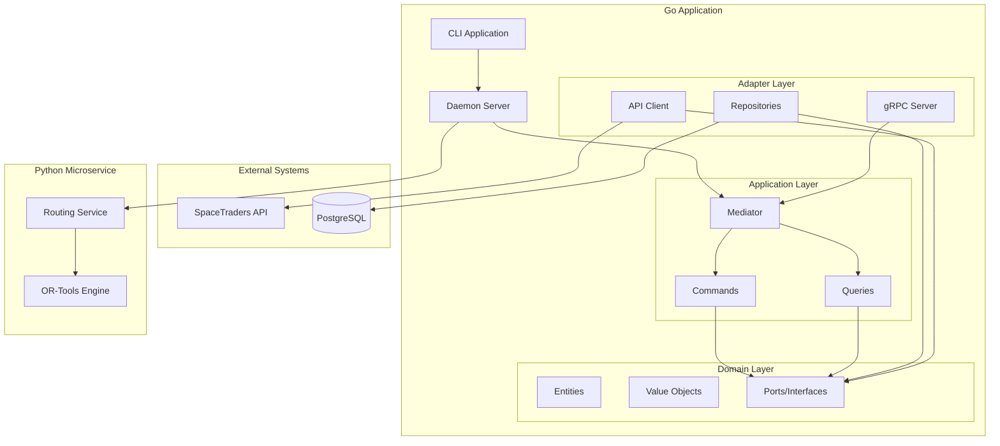
```mermaid
graph TB
    subgraph External["External Systems"]
        API[SpaceTraders API]
        DB[(PostgreSQL)]
    end

    subgraph GoApp["Go Application"]
        CLI[CLI Application]
        Daemon[Daemon Server]

        subgraph AppLayer["Application Layer"]
            Med[Mediator]
            Cmd[Commands]
            Qry[Queries]
        end

        subgraph DomainLayer["Domain Layer"]
            Ent[Entities]
            VO[Value Objects]
            Ports[Ports/Interfaces]
        end

        subgraph AdapterLayer["Adapter Layer"]
            APIClient[API Client]
            Repos[Repositories]
            GRPC[gRPC Server]
        end
    end

    subgraph PythonService["Python Microservice"]
        Routing[Routing Service]
        ORTools[OR-Tools Engine]
    end

    CLI --> Daemon
    Daemon --> Med
    Med --> Cmd
    Med --> Qry
    Cmd --> Ports
    Qry --> Ports
    Repos --> Ports
    APIClient --> Ports
    GRPC --> Med

    APIClient --> API
    Repos --> DB
    Daemon --> Routing
    Routing --> ORTools
```

---

## Component Architecture

### System Components Overview

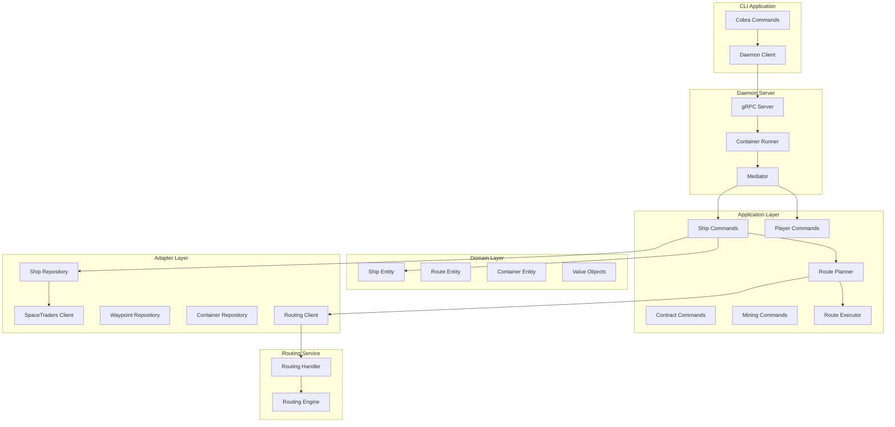
```mermaid
graph TB
    subgraph CLI_Container["CLI Application"]
        CLI_Cmd[Cobra Commands]
        DaemonClient[Daemon Client]
    end

    subgraph Daemon_Container["Daemon Server"]
        GRPCServer[gRPC Server]
        ContainerRunner[Container Runner]
        Mediator[Mediator]
    end

    subgraph App_Container["Application Layer"]
        ShipCmds[Ship Commands]
        PlayerCmds[Player Commands]
        ContractCmds[Contract Commands]
        MiningCmds[Mining Commands]
        RoutePlanner[Route Planner]
        RouteExecutor[Route Executor]
    end

    subgraph Domain_Container["Domain Layer"]
        ShipEntity[Ship Entity]
        RouteEntity[Route Entity]
        ContainerEntity[Container Entity]
        ValueObjects[Value Objects]
    end

    subgraph Adapter_Container["Adapter Layer"]
        APIClient[SpaceTraders Client]
        ShipRepo[Ship Repository]
        WaypointRepo[Waypoint Repository]
        ContainerRepo[Container Repository]
        RoutingClient[Routing Client]
    end

    subgraph Routing_Container["Routing Service"]
        RoutingHandler[Routing Handler]
        RoutingEngine[Routing Engine]
    end

    CLI_Cmd --> DaemonClient
    DaemonClient --> GRPCServer
    GRPCServer --> ContainerRunner
    ContainerRunner --> Mediator
    Mediator --> ShipCmds
    Mediator --> PlayerCmds
    ShipCmds --> RoutePlanner
    RoutePlanner --> RouteExecutor
    ShipCmds --> ShipEntity
    ShipCmds --> ShipRepo
    ShipRepo --> APIClient
    RoutePlanner --> RoutingClient
    RoutingClient --> RoutingHandler
    RoutingHandler --> RoutingEngine
```

---

## Domain Layer

### Class Diagram - Core Entities

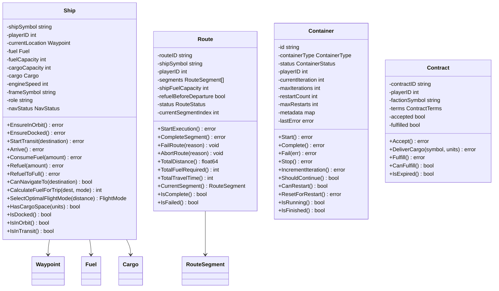
```mermaid
classDiagram
    class Ship {
        -shipSymbol string
        -playerID int
        -currentLocation Waypoint
        -fuel Fuel
        -fuelCapacity int
        -cargoCapacity int
        -cargo Cargo
        -engineSpeed int
        -frameSymbol string
        -role string
        -navStatus NavStatus
        +EnsureInOrbit() error
        +EnsureDocked() error
        +StartTransit(destination) error
        +Arrive() error
        +ConsumeFuel(amount) error
        +Refuel(amount) error
        +RefuelToFull() error
        +CanNavigateTo(destination) bool
        +CalculateFuelForTrip(dest, mode) int
        +SelectOptimalFlightMode(distance) FlightMode
        +HasCargoSpace(units) bool
        +IsDocked() bool
        +IsInOrbit() bool
        +IsInTransit() bool
    }

    class Route {
        -routeID string
        -shipSymbol string
        -playerID int
        -segments RouteSegment[]
        -shipFuelCapacity int
        -refuelBeforeDeparture bool
        -status RouteStatus
        -currentSegmentIndex int
        +StartExecution() error
        +CompleteSegment() error
        +FailRoute(reason) void
        +AbortRoute(reason) void
        +TotalDistance() float64
        +TotalFuelRequired() int
        +TotalTravelTime() int
        +CurrentSegment() RouteSegment
        +IsComplete() bool
        +IsFailed() bool
    }

    class Container {
        -id string
        -containerType ContainerType
        -status ContainerStatus
        -playerID int
        -currentIteration int
        -maxIterations int
        -restartCount int
        -maxRestarts int
        -metadata map
        -lastError error
        +Start() error
        +Complete() error
        +Fail(err) error
        +Stop() error
        +IncrementIteration() error
        +ShouldContinue() bool
        +CanRestart() bool
        +ResetForRestart() error
        +IsRunning() bool
        +IsFinished() bool
    }

    class Contract {
        -contractID string
        -playerID int
        -factionSymbol string
        -terms ContractTerms
        -accepted bool
        -fulfilled bool
        +Accept() error
        +DeliverCargo(symbol, units) error
        +Fulfill() error
        +CanFulfill() bool
        +IsExpired() bool
    }

    Ship --> Waypoint
    Ship --> Fuel
    Ship --> Cargo
    Route --> RouteSegment
```

### Value Objects

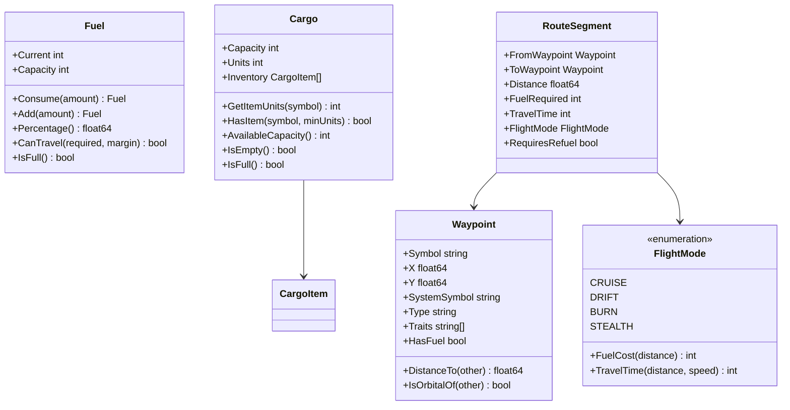
```mermaid
classDiagram
    class Fuel {
        +Current int
        +Capacity int
        +Consume(amount) Fuel
        +Add(amount) Fuel
        +Percentage() float64
        +CanTravel(required, margin) bool
        +IsFull() bool
    }

    class Waypoint {
        +Symbol string
        +X float64
        +Y float64
        +SystemSymbol string
        +Type string
        +Traits string[]
        +HasFuel bool
        +DistanceTo(other) float64
        +IsOrbitalOf(other) bool
    }

    class Cargo {
        +Capacity int
        +Units int
        +Inventory CargoItem[]
        +GetItemUnits(symbol) int
        +HasItem(symbol, minUnits) bool
        +AvailableCapacity() int
        +IsEmpty() bool
        +IsFull() bool
    }

    class FlightMode {
        <<enumeration>>
        CRUISE
        DRIFT
        BURN
        STEALTH
        +FuelCost(distance) int
        +TravelTime(distance, speed) int
    }

    class RouteSegment {
        +FromWaypoint Waypoint
        +ToWaypoint Waypoint
        +Distance float64
        +FuelRequired int
        +TravelTime int
        +FlightMode FlightMode
        +RequiresRefuel bool
    }

    Cargo --> CargoItem
    RouteSegment --> Waypoint
    RouteSegment --> FlightMode
```

### State Machine - Ship Navigation

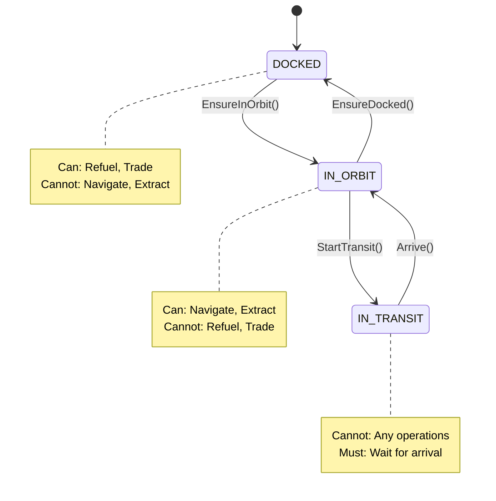
```mermaid
stateDiagram-v2
    [*] --> DOCKED

    DOCKED --> IN_ORBIT : EnsureInOrbit()
    IN_ORBIT --> DOCKED : EnsureDocked()
    IN_ORBIT --> IN_TRANSIT : StartTransit()
    IN_TRANSIT --> IN_ORBIT : Arrive()

    note right of DOCKED
        Can: Refuel, Trade
        Cannot: Navigate, Extract
    end note

    note right of IN_ORBIT
        Can: Navigate, Extract
        Cannot: Refuel, Trade
    end note

    note right of IN_TRANSIT
        Cannot: Any operations
        Must: Wait for arrival
    end note
```

### State Machine - Route Execution

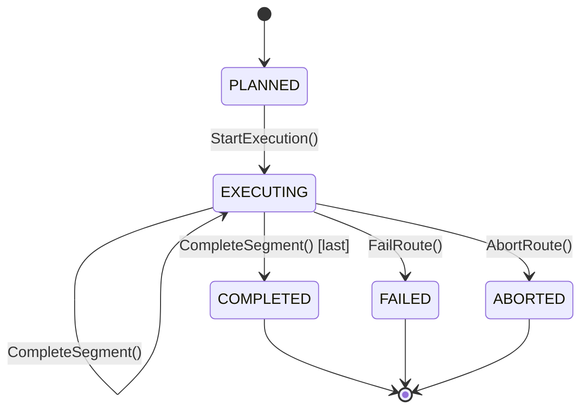
```mermaid
stateDiagram-v2
    [*] --> PLANNED

    PLANNED --> EXECUTING : StartExecution()
    EXECUTING --> EXECUTING : CompleteSegment()
    EXECUTING --> COMPLETED : CompleteSegment() [last]
    EXECUTING --> FAILED : FailRoute()
    EXECUTING --> ABORTED : AbortRoute()

    COMPLETED --> [*]
    FAILED --> [*]
    ABORTED --> [*]
```

### State Machine - Container Lifecycle

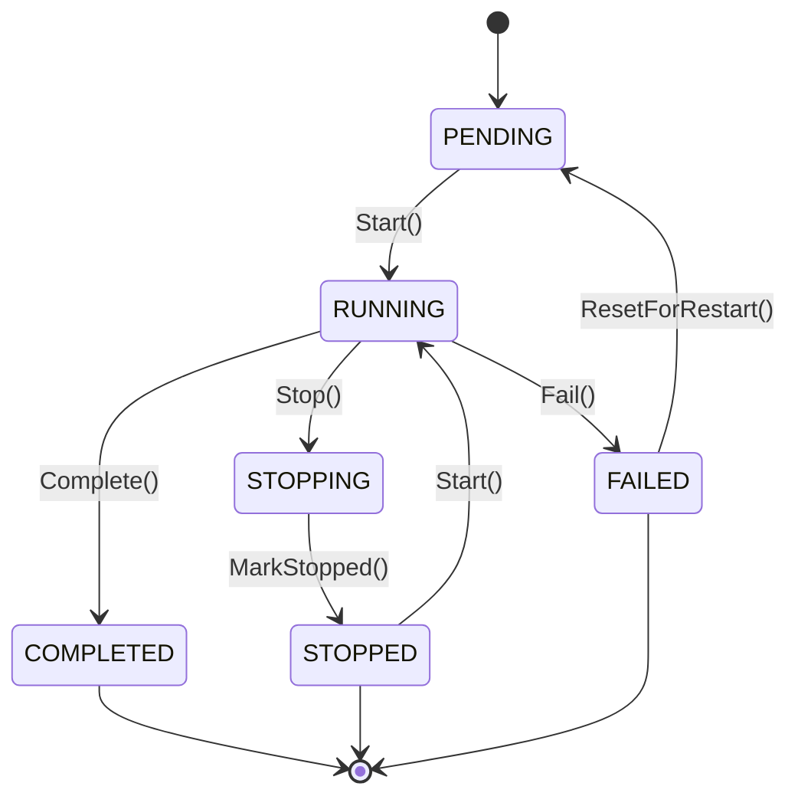
```mermaid
stateDiagram-v2
    [*] --> PENDING

    PENDING --> RUNNING : Start()
    RUNNING --> COMPLETED : Complete()
    RUNNING --> FAILED : Fail()
    RUNNING --> STOPPING : Stop()
    STOPPING --> STOPPED : MarkStopped()

    FAILED --> PENDING : ResetForRestart()
    STOPPED --> RUNNING : Start()

    COMPLETED --> [*]
    STOPPED --> [*]
    FAILED --> [*]
```

---

## Application Layer

### CQRS Pattern

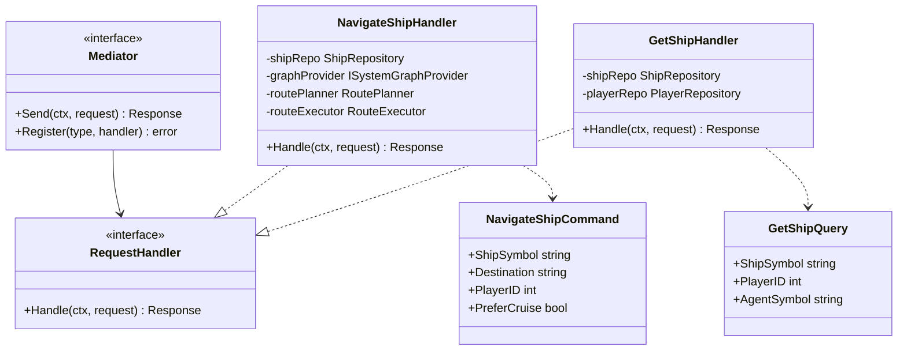
```mermaid
classDiagram
    class Mediator {
        <<interface>>
        +Send(ctx, request) Response
        +Register(type, handler) error
    }

    class RequestHandler {
        <<interface>>
        +Handle(ctx, request) Response
    }

    class NavigateShipCommand {
        +ShipSymbol string
        +Destination string
        +PlayerID int
        +PreferCruise bool
    }

    class NavigateShipHandler {
        -shipRepo ShipRepository
        -graphProvider ISystemGraphProvider
        -routePlanner RoutePlanner
        -routeExecutor RouteExecutor
        +Handle(ctx, request) Response
    }

    class GetShipQuery {
        +ShipSymbol string
        +PlayerID int
        +AgentSymbol string
    }

    class GetShipHandler {
        -shipRepo ShipRepository
        -playerRepo PlayerRepository
        +Handle(ctx, request) Response
    }

    Mediator --> RequestHandler
    NavigateShipHandler ..|> RequestHandler
    GetShipHandler ..|> RequestHandler
    NavigateShipHandler ..> NavigateShipCommand
    GetShipHandler ..> GetShipQuery
```

### Port Interfaces


```mermaid
classDiagram
    class ShipRepository {
        <<interface>>
        +FindBySymbol(ctx, symbol, playerID) Ship
        +FindAllByPlayer(ctx, playerID) Ship[]
        +Navigate(ctx, ship, dest, playerID) error
        +Dock(ctx, ship, playerID) error
        +Orbit(ctx, ship, playerID) error
        +Refuel(ctx, ship, playerID, units) error
    }

    class PlayerRepository {
        <<interface>>
        +FindByID(ctx, playerID) Player
        +FindByAgentSymbol(ctx, agent) Player
        +Save(ctx, player) error
    }

    class WaypointRepository {
        <<interface>>
        +FindBySymbol(ctx, symbol, system) Waypoint
        +ListBySystem(ctx, system) Waypoint[]
        +ListBySystemWithTrait(ctx, system, trait) Waypoint[]
    }

    class RoutingClient {
        <<interface>>
        +PlanRoute(ctx, request) RouteResponse
        +OptimizeTour(ctx, request) TourResponse
        +PartitionFleet(ctx, request) VRPResponse
    }

    class APIClient {
        <<interface>>
        +GetShip(ctx, symbol, token) ShipData
        +NavigateShip(ctx, symbol, dest, token) NavResult
        +OrbitShip(ctx, symbol, token) error
        +DockShip(ctx, symbol, token) error
        +RefuelShip(ctx, symbol, token, units) error
    }
```

### Command Organization

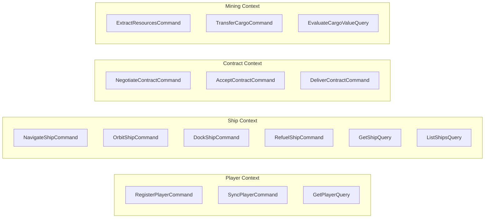
```mermaid
graph LR
    subgraph Player["Player Context"]
        RegisterPlayer[RegisterPlayerCommand]
        SyncPlayer[SyncPlayerCommand]
        GetPlayer[GetPlayerQuery]
    end

    subgraph Ship["Ship Context"]
        NavigateShip[NavigateShipCommand]
        OrbitShip[OrbitShipCommand]
        DockShip[DockShipCommand]
        RefuelShip[RefuelShipCommand]
        GetShip[GetShipQuery]
        ListShips[ListShipsQuery]
    end

    subgraph Contract["Contract Context"]
        NegotiateContract[NegotiateContractCommand]
        AcceptContract[AcceptContractCommand]
        DeliverContract[DeliverContractCommand]
    end

    subgraph Mining["Mining Context"]
        ExtractResources[ExtractResourcesCommand]
        TransferCargo[TransferCargoCommand]
        EvaluateCargoValue[EvaluateCargoValueQuery]
    end
```

---

## Adapter Layer

### Persistence Adapters

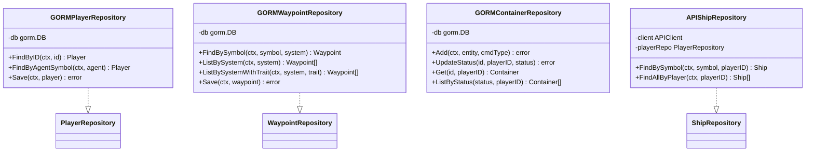
```mermaid
classDiagram
    class GORMPlayerRepository {
        -db gorm.DB
        +FindByID(ctx, id) Player
        +FindByAgentSymbol(ctx, agent) Player
        +Save(ctx, player) error
    }

    class GORMWaypointRepository {
        -db gorm.DB
        +FindBySymbol(ctx, symbol, system) Waypoint
        +ListBySystem(ctx, system) Waypoint[]
        +ListBySystemWithTrait(ctx, system, trait) Waypoint[]
        +Save(ctx, waypoint) error
    }

    class GORMContainerRepository {
        -db gorm.DB
        +Add(ctx, entity, cmdType) error
        +UpdateStatus(id, playerID, status) error
        +Get(id, playerID) Container
        +ListByStatus(status, playerID) Container[]
    }

    class APIShipRepository {
        -client APIClient
        -playerRepo PlayerRepository
        +FindBySymbol(ctx, symbol, playerID) Ship
        +FindAllByPlayer(ctx, playerID) Ship[]
    }

    GORMPlayerRepository ..|> PlayerRepository
    GORMWaypointRepository ..|> WaypointRepository
    APIShipRepository ..|> ShipRepository
```

### API Adapter

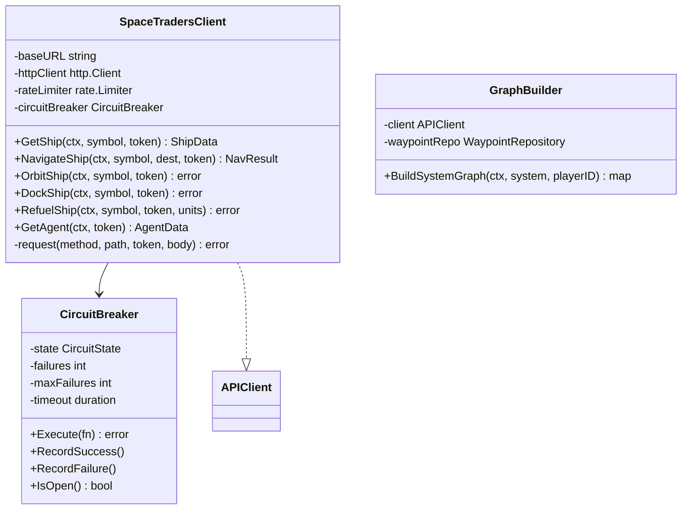
```mermaid
classDiagram
    class SpaceTradersClient {
        -baseURL string
        -httpClient http.Client
        -rateLimiter rate.Limiter
        -circuitBreaker CircuitBreaker
        +GetShip(ctx, symbol, token) ShipData
        +NavigateShip(ctx, symbol, dest, token) NavResult
        +OrbitShip(ctx, symbol, token) error
        +DockShip(ctx, symbol, token) error
        +RefuelShip(ctx, symbol, token, units) error
        +GetAgent(ctx, token) AgentData
        -request(method, path, token, body) error
    }

    class CircuitBreaker {
        -state CircuitState
        -failures int
        -maxFailures int
        -timeout duration
        +Execute(fn) error
        +RecordSuccess()
        +RecordFailure()
        +IsOpen() bool
    }

    class GraphBuilder {
        -client APIClient
        -waypointRepo WaypointRepository
        +BuildSystemGraph(ctx, system, playerID) map
    }

    SpaceTradersClient --> CircuitBreaker
    SpaceTradersClient ..|> APIClient
```

### gRPC Server

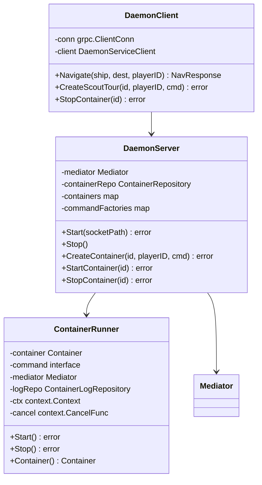
```mermaid
classDiagram
    class DaemonServer {
        -mediator Mediator
        -containerRepo ContainerRepository
        -containers map
        -commandFactories map
        +Start(socketPath) error
        +Stop()
        +CreateContainer(id, playerID, cmd) error
        +StartContainer(id) error
        +StopContainer(id) error
    }

    class ContainerRunner {
        -container Container
        -command interface
        -mediator Mediator
        -logRepo ContainerLogRepository
        -ctx context.Context
        -cancel context.CancelFunc
        +Start() error
        +Stop() error
        +Container() Container
    }

    class DaemonClient {
        -conn grpc.ClientConn
        -client DaemonServiceClient
        +Navigate(ship, dest, playerID) NavResponse
        +CreateScoutTour(id, playerID, cmd) error
        +StopContainer(id) error
    }

    DaemonServer --> ContainerRunner
    DaemonServer --> Mediator
    DaemonClient --> DaemonServer
```

### Database Schema

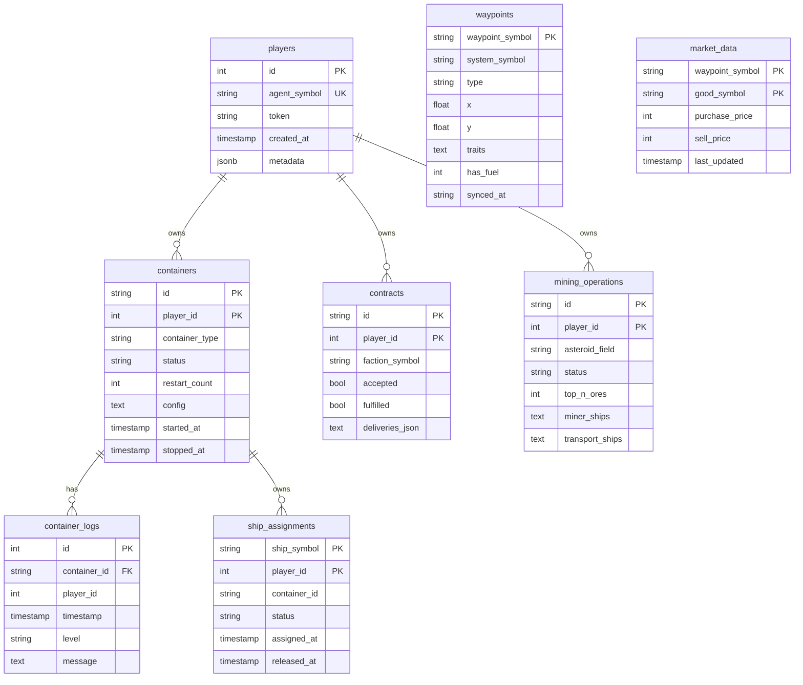
```mermaid
erDiagram
    players ||--o{ containers : owns
    players ||--o{ contracts : owns
    players ||--o{ mining_operations : owns
    containers ||--o{ container_logs : has
    containers ||--o{ ship_assignments : owns

    players {
        int id PK
        string agent_symbol UK
        string token
        timestamp created_at
        jsonb metadata
    }

    waypoints {
        string waypoint_symbol PK
        string system_symbol
        string type
        float x
        float y
        text traits
        int has_fuel
        string synced_at
    }

    containers {
        string id PK
        int player_id PK
        string container_type
        string status
        int restart_count
        text config
        timestamp started_at
        timestamp stopped_at
    }

    container_logs {
        int id PK
        string container_id FK
        int player_id
        timestamp timestamp
        string level
        text message
    }

    ship_assignments {
        string ship_symbol PK
        int player_id PK
        string container_id
        string status
        timestamp assigned_at
        timestamp released_at
    }

    contracts {
        string id PK
        int player_id PK
        string faction_symbol
        bool accepted
        bool fulfilled
        text deliveries_json
    }

    market_data {
        string waypoint_symbol PK
        string good_symbol PK
        int purchase_price
        int sell_price
        timestamp last_updated
    }

    mining_operations {
        string id PK
        int player_id PK
        string asteroid_field
        string status
        int top_n_ores
        text miner_ships
        text transport_ships
    }
```

---

## Routing Service

### Python Components

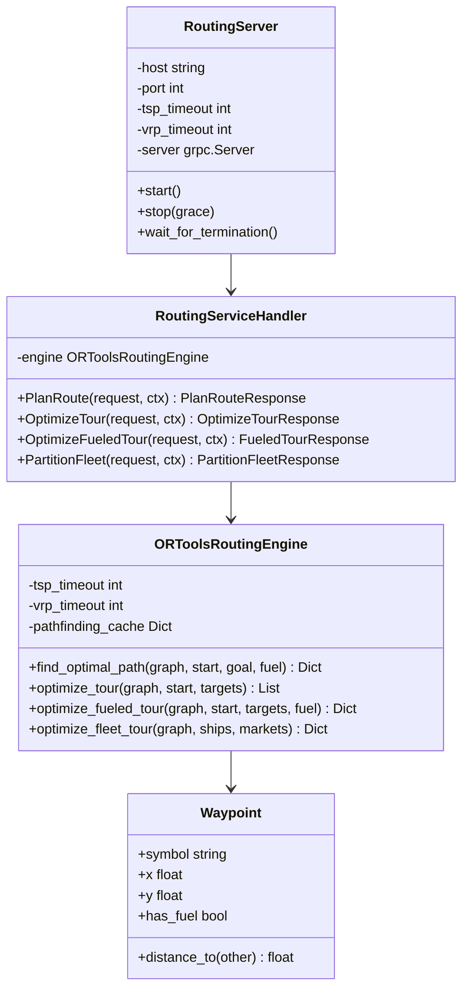
```mermaid
classDiagram
    class RoutingServer {
        -host string
        -port int
        -tsp_timeout int
        -vrp_timeout int
        -server grpc.Server
        +start()
        +stop(grace)
        +wait_for_termination()
    }

    class RoutingServiceHandler {
        -engine ORToolsRoutingEngine
        +PlanRoute(request, ctx) PlanRouteResponse
        +OptimizeTour(request, ctx) OptimizeTourResponse
        +OptimizeFueledTour(request, ctx) FueledTourResponse
        +PartitionFleet(request, ctx) PartitionFleetResponse
    }

    class ORToolsRoutingEngine {
        -tsp_timeout int
        -vrp_timeout int
        -pathfinding_cache Dict
        +find_optimal_path(graph, start, goal, fuel) Dict
        +optimize_tour(graph, start, targets) List
        +optimize_fueled_tour(graph, start, targets, fuel) Dict
        +optimize_fleet_tour(graph, ships, markets) Dict
    }

    class Waypoint {
        +symbol string
        +x float
        +y float
        +has_fuel bool
        +distance_to(other) float
    }

    RoutingServer --> RoutingServiceHandler
    RoutingServiceHandler --> ORToolsRoutingEngine
    ORToolsRoutingEngine --> Waypoint
```

### Algorithm Flow


```mermaid
graph TB
    subgraph Dijkstra["PlanRoute - Dijkstra"]
        D1[Initialize Priority Queue]
        D2[Pop Min-Time State]
        D3{Goal Reached?}
        D4[Explore Refuel]
        D5[Explore Travel]
        D6[Add to Queue]
        D7[Return Path]

        D1 --> D2
        D2 --> D3
        D3 -->|No| D4
        D4 --> D5
        D5 --> D6
        D6 --> D2
        D3 -->|Yes| D7
    end

    subgraph TSP["OptimizeTour - TSP"]
        T1[Build Distance Matrix]
        T2[Create OR-Tools Model]
        T3[Configure Solver]
        T4[Solve with GLS]
        T5[Extract Visit Order]

        T1 --> T2
        T2 --> T3
        T3 --> T4
        T4 --> T5
    end

    subgraph VRP["PartitionFleet - VRP"]
        V1[Build Cost Matrix]
        V2[Create Multi-Vehicle Model]
        V3[Add Disjunction Constraints]
        V4[Solve with GLS]
        V5[Extract Assignments]

        V1 --> V2
        V2 --> V3
        V3 --> V4
        V4 --> V5
    end
```

### gRPC Service

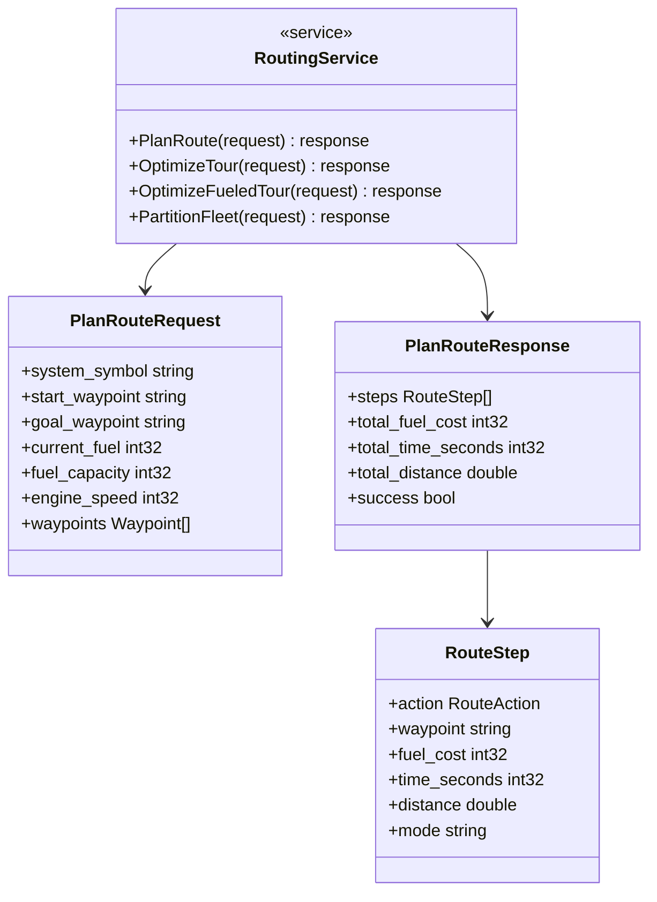
```mermaid
classDiagram
    class RoutingService {
        <<service>>
        +PlanRoute(request) response
        +OptimizeTour(request) response
        +OptimizeFueledTour(request) response
        +PartitionFleet(request) response
    }

    class PlanRouteRequest {
        +system_symbol string
        +start_waypoint string
        +goal_waypoint string
        +current_fuel int32
        +fuel_capacity int32
        +engine_speed int32
        +waypoints Waypoint[]
    }

    class PlanRouteResponse {
        +steps RouteStep[]
        +total_fuel_cost int32
        +total_time_seconds int32
        +total_distance double
        +success bool
    }

    class RouteStep {
        +action RouteAction
        +waypoint string
        +fuel_cost int32
        +time_seconds int32
        +distance double
        +mode string
    }

    RoutingService --> PlanRouteRequest
    RoutingService --> PlanRouteResponse
    PlanRouteResponse --> RouteStep
```

---

## Sequence Diagrams

### Ship Navigation Flow

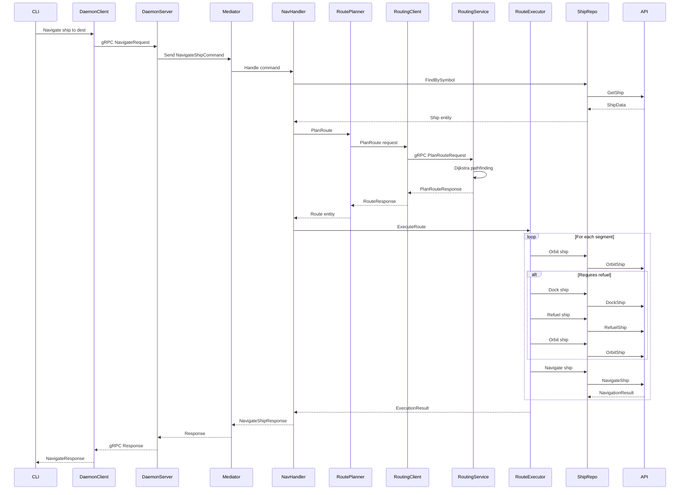
```mermaid
sequenceDiagram
    participant CLI
    participant DC as DaemonClient
    participant DS as DaemonServer
    participant Med as Mediator
    participant NH as NavHandler
    participant RP as RoutePlanner
    participant RC as RoutingClient
    participant RS as RoutingService
    participant RE as RouteExecutor
    participant SR as ShipRepo
    participant API

    CLI->>DC: Navigate ship to dest
    DC->>DS: gRPC NavigateRequest
    DS->>Med: Send NavigateShipCommand
    Med->>NH: Handle command

    NH->>SR: FindBySymbol
    SR->>API: GetShip
    API-->>SR: ShipData
    SR-->>NH: Ship entity

    NH->>RP: PlanRoute
    RP->>RC: PlanRoute request
    RC->>RS: gRPC PlanRouteRequest
    RS->>RS: Dijkstra pathfinding
    RS-->>RC: PlanRouteResponse
    RC-->>RP: RouteResponse
    RP-->>NH: Route entity

    NH->>RE: ExecuteRoute

    loop For each segment
        RE->>SR: Orbit ship
        SR->>API: OrbitShip

        alt Requires refuel
            RE->>SR: Dock ship
            SR->>API: DockShip
            RE->>SR: Refuel ship
            SR->>API: RefuelShip
            RE->>SR: Orbit ship
            SR->>API: OrbitShip
        end

        RE->>SR: Navigate ship
        SR->>API: NavigateShip
        API-->>SR: NavigationResult
    end

    RE-->>NH: ExecutionResult
    NH-->>Med: NavigateShipResponse
    Med-->>DS: Response
    DS-->>DC: gRPC Response
    DC-->>CLI: NavigateResponse
```

### Container Lifecycle

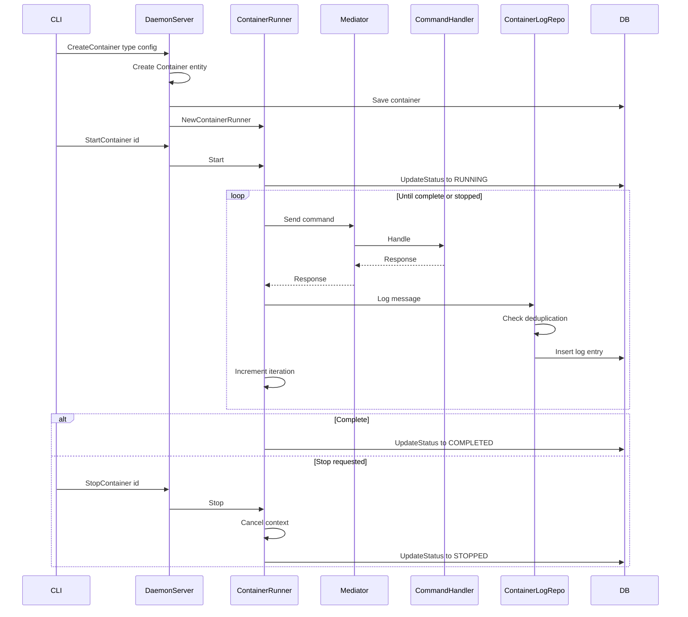
```mermaid
sequenceDiagram
    participant CLI
    participant DS as DaemonServer
    participant CR as ContainerRunner
    participant Med as Mediator
    participant Cmd as CommandHandler
    participant Log as ContainerLogRepo
    participant DB

    CLI->>DS: CreateContainer type config
    DS->>DS: Create Container entity
    DS->>DB: Save container
    DS->>CR: NewContainerRunner

    CLI->>DS: StartContainer id
    DS->>CR: Start
    CR->>DB: UpdateStatus to RUNNING

    loop Until complete or stopped
        CR->>Med: Send command
        Med->>Cmd: Handle
        Cmd-->>Med: Response
        Med-->>CR: Response

        CR->>Log: Log message
        Log->>Log: Check deduplication
        Log->>DB: Insert log entry

        CR->>CR: Increment iteration
    end

    alt Complete
        CR->>DB: UpdateStatus to COMPLETED
    else Stop requested
        CLI->>DS: StopContainer id
        DS->>CR: Stop
        CR->>CR: Cancel context
        CR->>DB: UpdateStatus to STOPPED
    end
```

### Route Planning with Refuel

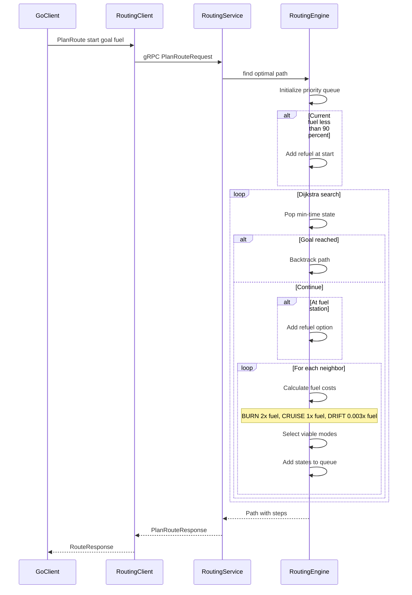
```mermaid
sequenceDiagram
    participant Go as GoClient
    participant RC as RoutingClient
    participant RS as RoutingService
    participant RE as RoutingEngine

    Go->>RC: PlanRoute start goal fuel
    RC->>RS: gRPC PlanRouteRequest
    RS->>RE: find optimal path

    RE->>RE: Initialize priority queue

    alt Current fuel less than 90 percent
        RE->>RE: Add refuel at start
    end

    loop Dijkstra search
        RE->>RE: Pop min-time state

        alt Goal reached
            RE->>RE: Backtrack path
        else Continue
            alt At fuel station
                RE->>RE: Add refuel option
            end

            loop For each neighbor
                RE->>RE: Calculate fuel costs
                Note over RE: BURN 2x fuel, CRUISE 1x fuel, DRIFT 0.003x fuel
                RE->>RE: Select viable modes
                RE->>RE: Add states to queue
            end
        end
    end

    RE-->>RS: Path with steps
    RS-->>RC: PlanRouteResponse
    RC-->>Go: RouteResponse
```

### Fleet Partitioning VRP

```mermaid
sequenceDiagram
    participant Go as GoClient
    participant RC as RoutingClient
    participant RS as RoutingService
    participant RE as RoutingEngine
    participant OR as ORTools

    Go->>RC: PartitionFleet ships markets
    RC->>RS: gRPC PartitionFleetRequest
    RS->>RE: optimize fleet tour

    RE->>RE: Build cost matrix
    Note over RE: Uses Dijkstra with cache

    RE->>OR: Create RoutingIndexManager
    RE->>OR: Create RoutingModel
    RE->>OR: Register distance callback
    RE->>OR: Add TravelTime dimension

    loop For each market
        RE->>OR: AddDisjunction with penalty
    end

    RE->>OR: Configure search params
    Note over OR: PATH CHEAPEST ARC and GUIDED LOCAL SEARCH

    RE->>OR: SolveWithParameters
    OR-->>RE: Solution

    RE->>RE: Extract ship assignments
    RE->>RE: Fix depot markets

    RE-->>RS: Ship assignments
    RS-->>RC: PartitionFleetResponse
    RC-->>Go: VRPResponse
```

---

## Data Flow Patterns

### Hexagonal Architecture Flow

```mermaid
flowchart LR
    subgraph External
        CLI_User[CLI User]
        API_External[SpaceTraders API]
        DB_External[(PostgreSQL)]
    end

    subgraph Adapters
        CLI_Adapter[CLI Adapter]
        API_Adapter[API Client]
        DB_Adapter[Repositories]
        GRPC_Adapter[gRPC Server]
    end

    subgraph Application
        Commands[Commands]
        Queries[Queries]
        Services[Services]
    end

    subgraph Domain
        Entities[Entities]
        ValueObjects[Value Objects]
        Ports[Ports]
    end

    CLI_User --> CLI_Adapter
    CLI_Adapter --> Commands
    Commands --> Ports
    Ports --> Entities
    Entities --> ValueObjects

    Queries --> Ports
    Services --> Ports

    DB_Adapter --> Ports
    DB_Adapter --> DB_External

    API_Adapter --> Ports
    API_Adapter --> API_External

    GRPC_Adapter --> Commands
```

### Caching Strategy

```mermaid
flowchart TB
    Request[Incoming Request]

    subgraph Memory["In-Memory Cache"]
        LogCache[Log Deduplication<br/>60s window]
        PathCache[Pathfinding Cache<br/>VRP optimization]
    end

    subgraph DB_Cache["Database Cache"]
        WPCache[Waypoints<br/>2hr TTL]
        GraphCache[System Graphs<br/>Infinite TTL]
        MarketCache[Market Data<br/>Age-filtered]
    end

    subgraph NoCache["Always Fresh"]
        Ships[Ships]
        Credits[Credits]
    end

    subgraph Sources["Data Sources"]
        Database[(PostgreSQL)]
        API_Source[SpaceTraders API]
    end

    Request --> LogCache
    Request --> PathCache
    Request --> WPCache
    Request --> GraphCache
    Request --> MarketCache
    Request --> Ships
    Request --> Credits

    WPCache --> Database
    GraphCache --> Database
    MarketCache --> Database
    Ships --> API_Source
    Credits --> API_Source
```

---

## Key Design Decisions

### 1. Hexagonal Architecture

**Benefits:**
- Clear separation of business logic from infrastructure
- Easy to test with mock adapters
- Swap implementations without changing domain
- Dependencies point inward

**Trade-offs:**
- More boilerplate code
- Indirection can be confusing for newcomers
- Over-engineering for simple CRUD operations

### 2. CQRS Pattern

**Benefits:**
- Clear separation of read/write operations
- Different optimization strategies per operation
- Type-safe command dispatch via Mediator
- Explicit command/query semantics

**Trade-offs:**
- More code to maintain
- Eventual consistency challenges
- Overkill for simple operations

### 3. Immutable Value Objects

**Benefits:**
- Thread-safe by design
- Predictable behavior
- Easy to test and reason about
- Prevents accidental mutation

**Trade-offs:**
- Memory allocation overhead
- More verbose code (create new instances)
- Learning curve for developers

### 4. Python for Routing Service

**Benefits:**
- OR-Tools has best Python support
- Rapid prototyping for algorithms
- Rich ecosystem for optimization
- Easy to iterate on routing logic

**Trade-offs:**
- Network latency for gRPC calls
- Two languages to maintain
- Deployment complexity
- Python performance limitations

### 5. Ships Always Fresh from API

**Benefits:**
- Always accurate state
- Avoid stale navigation data
- Simplify consistency model
- No cache invalidation needed

**Trade-offs:**
- Higher API usage
- Slower operations
- Rate limiting concerns
- Network dependency

### 6. 60-Second Log Deduplication

**Benefits:**
- Reduce database writes
- Prevent log spam
- Match Python implementation
- Cleaner logs

**Trade-offs:**
- May miss legitimate duplicates
- Memory overhead for cache
- Additional complexity
- 60s is arbitrary

### 7. Safety Margin in Flight Mode Selection

**Benefits:**
- Prevent stranding ships
- Account for calculation errors
- Defensive programming
- Better reliability

**Configuration:**
- 4-unit fuel safety margin
- 90% fuel threshold for refueling
- DRIFT penalty 100k seconds unless fuel_efficient mode

---

## Appendix: File Organization

```
gobot/
├── cmd/
│   ├── spacetraders/           # CLI entry point
│   └── spacetraders-daemon/    # Daemon entry point
├── internal/
│   ├── domain/
│   │   ├── navigation/         # Ship, Route entities
│   │   ├── container/          # Container entity
│   │   ├── contract/           # Contract entity
│   │   ├── mining/             # MiningOperation entity
│   │   ├── player/             # Player entity
│   │   ├── shared/             # Value objects, errors
│   │   ├── routing/            # Routing port
│   │   ├── daemon/             # Daemon ports
│   │   └── system/             # System/graph ports
│   ├── application/
│   │   ├── common/             # Mediator, logger
│   │   ├── player/             # Player commands/queries
│   │   ├── ship/               # Ship commands/queries
│   │   ├── contract/           # Contract commands
│   │   ├── mining/             # Mining commands
│   │   ├── trading/            # Trading commands
│   │   ├── scouting/           # Scouting commands
│   │   └── shipyard/           # Shipyard commands
│   ├── adapters/
│   │   ├── api/                # SpaceTraders client
│   │   ├── cli/                # Cobra commands
│   │   ├── grpc/               # Daemon server
│   │   ├── persistence/        # GORM repositories
│   │   └── routing/            # Routing client
│   └── infrastructure/
│       └── ports/              # Infrastructure ports
├── pkg/
│   └── proto/
│       ├── daemon/             # Daemon protobuf
│       └── routing/            # Routing protobuf
├── services/
│   └── routing-service/
│       ├── server/             # Python gRPC server
│       ├── handlers/           # RPC handlers
│       ├── utils/              # Routing engine
│       └── generated/          # Generated Python code
└── test/
    └── bdd/
        ├── features/           # Gherkin features
        └── steps/              # Step definitions
```

---

## Conclusion

The SpaceTraders Go Bot demonstrates a well-structured implementation of Hexagonal Architecture with CQRS, providing:

1. **Clean Separation** - Domain logic isolated from infrastructure
2. **Type Safety** - Strong typing throughout with explicit state machines
3. **Scalability** - Goroutine-based concurrency with proper lifecycle management
4. **Testability** - BDD tests in isolated directory, mock adapters
5. **Extensibility** - Easy to add new commands, repositories, and adapters
6. **Performance** - Caching strategies, rate limiting, circuit breakers

The architecture supports complex workflows like multi-hop navigation with fuel constraints, fleet partitioning, and automated contract fulfillment while maintaining code clarity and maintainability.

### Key Metrics

- **Domain Entities**: 5 (Ship, Route, Container, Contract, MiningOperation)
- **Value Objects**: 6 (Fuel, Waypoint, Cargo, FlightMode, RouteSegment, CargoItem)
- **Commands**: 15+ across 6 bounded contexts
- **Queries**: 5+ for read operations
- **Repositories**: 12 adapters (GORM + API)
- **State Machines**: 3 explicit (Ship, Route, Container)
- **Microservices**: 2 (Go Daemon, Python Routing)

This architecture successfully balances complexity with maintainability, providing a solid foundation for ongoing development and feature expansion.
